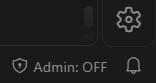
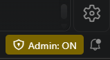

<div dir="rtl">

# מתג מנהל ל-VS Code: הרשאות מנהל ל-Claude Code רק כשצריך

קורה לכם שאתם מבקשים מקלוד לתקן משהו ב-Windows עצמו, והוא נתקע על Access denied? להפעיל מחדש שירות, לשנות הגדרה ב-Defender, לבדוק את בריאות הדיסק, לתקן התקנה של Office...

הסיבה: Claude Code רץ עם ההרשאות של VS Code, ובאמצע שיחה אין לו דרך לקבל הרשאות מנהל. נשאר לכם להריץ את הפקודות שלו בעצמכם בחלון מנהל, כשהוא לא רואה את התוצאה, או לסגור הכול ולפתוח מחדש עם "הפעל כמנהל".

**ולהריץ את VS Code כמנהל תמיד זה לא פתרון,** כי יש לזה שלושה מחירים:

<ul dir="rtl">
<li><b>בקשת אישור של Windows</b> בכל פתיחה של VS Code.</li>
<li><b>אין יותר עדכונים אוטומטיים.</b> בהתקנה הרגילה, VS Code מפסיק לעדכן את עצמו כשהוא רץ כמנהל.</li>
<li><b>אי אפשר לגרור קבצים</b> מהסייר לתוך VS Code או לצ'אט, כי Windows חוסם גרירה מחלון רגיל לחלון שרץ כמנהל.</li>
</ul>

**המתג נותן את שני העולמות.** כפתור אחד בשורת הסטטוס קובע אם הפתיחה הבאה של VS Code תהיה כמנהל. מדליקים כשמשימה צריכה את זה, ומכבים כשמסיימים.

<p align="center"> &nbsp; &nbsp; </p>

<h6 dir="rtl" align="center"><i>כבוי: VS Code נפתח כרגיל. דלוק ומודגש: הפתיחה הבאה תהיה כמנהל.</i></h6>

---

## איך משתמשים

<ol dir="rtl">
<li>לוחצים על הכפתור בשורת הסטטוס, והוא עובר ל-<code>Admin: ON</code>.</li>
<li>סוגרים את VS Code <b>לגמרי</b>, את כל החלונות, ופותחים מחדש. Reload Window לא מספיק, כי ההרשאות נקבעות רק כש-VS Code עולה.</li>
<li>מופיעה בקשת אישור של Windows, ומעכשיו Claude Code יכול לבצע גם פעולות של מנהל.</li>
<li>סיימתם? לוחצים שוב, סוגרים ופותחים, ו-VS Code חוזר לרגיל.</li>
</ol>

מעבר עם העכבר על הכפתור מראה את שני המצבים: איך רץ החלון הנוכחי, ואיך תעלה הפתיחה הבאה.

<blockquote dir="rtl">
<p><b>כשהמתג דלוק, גם Claude Code רץ כמנהל</b>, וכל פקודה שהוא מריץ יכולה לשנות את המערכת. לכן מדליקים רק לזמן המשימה.</p>
</blockquote>

מאחורי הקלעים זו בדיוק תיבת הסימון "הפעל תוכנית זו כמנהל" שבמאפיינים של VS Code, רק בלחיצה אחת מתוך העורך.

---

## דרישות

<ul dir="rtl">
<li>מערכת Windows 10 או 11</li>
<li>משתמש עם הרשאות מנהל במחשב (אחרת Windows יבקש סיסמה של מנהל)</li>
<li>עורך VS Code בגרסה 1.70 ומעלה</li>
</ul>

---

## התקנה

### התקנה מהירה (הדבקה לתוך Claude Code)

פותחים שיחה ב-Claude Code ומדביקים את הבלוק:

<div dir="ltr">

```
Install the VS Code Admin Toggle extension: download https://github.com/arielmoatti/claude-code-vsc-admin-toggle/releases/latest/download/claude-code-vsc-admin-toggle.vsix to a temp folder, run "code --install-extension <that file> --force", then tell me to reload the VS Code window. Communicate with me in Hebrew throughout.
```

</div>

### התקנה ידנית

<ol dir="rtl">
<li>מורידים את <a href="https://github.com/arielmoatti/claude-code-vsc-admin-toggle/releases/latest/download/claude-code-vsc-admin-toggle.vsix">קובץ ההתקנה</a></li>
<li>ב-VS Code: <code>Extensions > ... > Install from VSIX</code>, ובוחרים את הקובץ</li>
<li>עושים Reload Window</li>
</ol>

---

## הסרה

**מכבים את המתג לפני שמסירים את התוסף.** ההגדרה שמורה ב-Windows ולא בתוך התוסף, ולכן אם מסירים אותו כשהוא דלוק, VS Code ימשיך לעלות כמנהל. אם זה כבר קרה, הפקודה הזו מנקה את ההגדרה:

<div dir="ltr">

```powershell
reg delete "HKCU\Software\Microsoft\Windows NT\CurrentVersion\AppCompatFlags\Layers" /v "$env:LOCALAPPDATA\Programs\Microsoft VS Code\Code.exe" /f
```

</div>

זה הנתיב בהתקנה הרגילה של VS Code. בהתקנה לכל המחשב הוא `C:\Program Files\Microsoft VS Code\Code.exe`.

---

חלק מ<a href="https://github.com/arielmoatti/claude-on-vscode">חבילת הכלים ל-Claude Code</a>. רישיון MIT.

</div>
